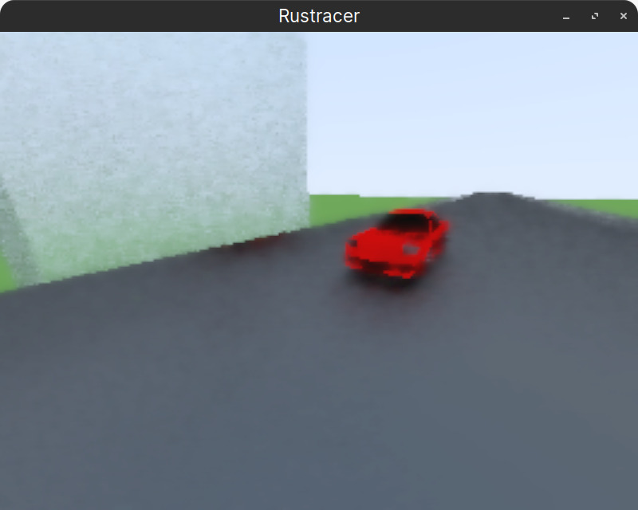
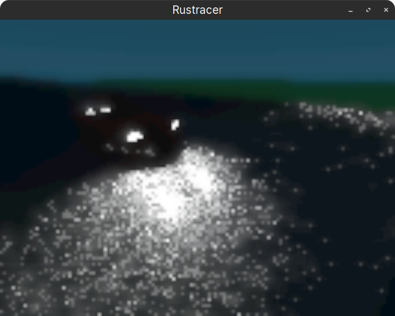

# Rustracer
A real time path tracer in Rust and WGPU.

This is based on the "Ray Tracing In One Weekend" book and (partially) its sequel.

My goal is to make a real-time path tracer that can run on low end hardware (integrated graphics).

# Screenshots

Day scene, 160 fps.


Night scene, 2 fps (darkness requires more samples reducing fps).


# Controls
WASD to move around. Space to go up, Left Shift to go down.

Move your mouse to look around. By default it will be locked. Click to unlock it, and click again to lock it.

# How does it work?
- It runs the path tracer in a compute shader and stores the result in a texture.
- Then it copies the texture to the screen via the fragment shader (with a fullscreen rectangle mesh).

All shaders are in `src/shaders`. The compute shader consists of `shaders/compute_shader.wgsl` and `shaders/raytracer/*`.

# Constants
If the raytracer is too slow, you can reduce the settings in `rustracer/src/main.rs` here:

```
let renderer = rst_render::Renderer::new(
    window.clone(),
    &materials,
    ShaderConfig {
        samples: 8,
        bounces: 4,
        antialiasing: false,
        motion_blur: true,
        downscale: 4.0,
        // ...
```

You can edit it to match your hardware.

- `samples` is the number of samples per pixel. (2-4 low, 6 medium, 10+ high)
- `bounces` is the number of bounces per ray. (2-4 low, 6 medium, 10+ high)
- `antialiasing` is whether to use antialiasing. (true or false)
- `motion_blur` is whether to use motion blur. (true or false)
- `downscale` is the amount to downscale the image by.
  (1.0 is full resolution, 2.0 is half resolution, 4.0 is quarter resolution, etc.)

# Build
- Install Rust
- Clone the repo `git clone https://github.com/Mrmayman/rustracer.git`
- Navigate inside the new rustracer folder `cd rustracer`
- Do `cargo run --release`

# Notes:
- You can use this as a library by importing `rst_render` in your project.
- If you find any problem with the code, feel free to contact me or start an issue in the repository.
- The code may not be the best, I'm still rather inexperienced in programming.
- ~~You can check out the old (pretty horrible) versions of this in the old_versions folder. There's a README.md there too, for more information.~~
  Update: This is no longer the case. Go to commit id `baa1bce68a68b001a8189469274fab3158291cb7` for this.

# To-Do
- Texture support
- Noise texture support
- Hybrid rendering (ray tracing + rasterization)
- Skyboxes
- Sky models (procedural)
- Volumetric rendering (fog, smoke, etc.)
- Point lights

# Credits
[_Ray Tracing in One Weekend_](https://raytracing.github.io/books/RayTracingInOneWeekend.html)

[_Ray Tracing: The Next Week_](https://raytracing.github.io/books/RayTracingTheNextWeek.html)

[glslSmartDenoise (for denoising the image)](https://github.com/BrutPitt/glslSmartDeNoise/tree/master)

[AMD FSR 1.0 (for upscaling, disabled by default)](https://github.com/GPUOpen-Effects/FidelityFX-FSR)
